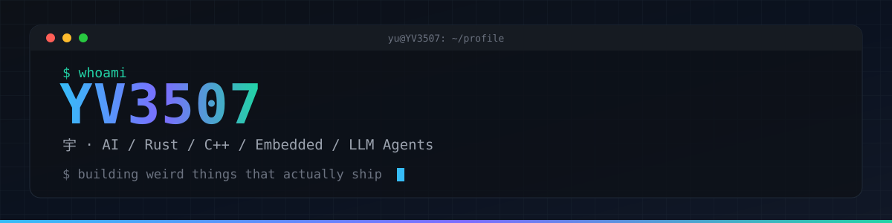

<!--
  图片两类：① 外链服务 shields.io / readme-typing-svg.demolab.com / visitor-badge.laobi.icu
  （实测可直连）；② 本仓库 Action 生成，走 fastly.jsdelivr.net 镜像 raw.githubusercontent.com，
  push 后需到 Actions 页手动 Run 一次 snake 工作流，否则是裂图。
  本文件不写任何固定数字：star / fork / 贡献者数一律由 shields.io 实时渲染。
  统计图只留一张 snake：它渲染的是贡献日历（含跨仓库提交），且做了亮/暗双主题。
  已删：5 张 profile-summary-cards（数据源是"自己名下的仓库"，与本人贡献结构相反）、
  3D 贡献图（与 snake 同一份数据、固定深色主题、全篇最高）、
  streak-stats（同为贡献日历的另一种呈现，且固定深色主题）。
  本文件刻意保持纯 BMP（不写 emoji）：edit 工具与 ReadAllLines+join 都会静默吞掉非 BMP 字符，
  与其每次验收不如不写；改写一律走 ReadAllText -> Replace -> WriteAllText(UTF8Encoding($false))。
  名言靠左、署名靠右：用 
 / 
——GitHub 剥掉 style，但保留 align 属性。
  头像亮/暗双主题：image/+1.jpeg（亮）与 image/-1.jpeg（暗）用 <picture> + prefers-color-scheme 自动切换。
  GitHub 保留 <picture>/<source> 的 media 与 srcset，但 media 只认 prefers-color-scheme，
  按宽度做 art direction 会被剥掉；URL 片段法 #gh-dark-mode-only / #gh-light-mode-only 已被 GitHub 废弃。
  仓库内相对路径图片由 GitHub 自己托管渲染（不经过本机 hosts 污染的 raw.githubusercontent.com）。
  两张头像已压到 400x400（显示宽 200px 的 2 倍），一共约 49KB；不要再放回 1500px 的原图（两张共 761KB）。
  与引语左右并列用 <table>：GitHub 会剥掉 style 属性（flex/grid 无效），表格内必须全用 HTML 且不能夹空行。
-->

 

<table>
<tr>
<td>
<blockquote>

<em>"Perfection is achieved, not when there is nothing more to add, but when there is nothing left to take away." 
完美不是无可增添，而是无可删减。</em>

&mdash;&mdash;&mdash;安托万·德·圣-埃克苏佩里

</blockquote>
协作开发 · 功能并入 · 重构与集成 —— 把已经跑起来的项目接过来，让它跑得更好。 
Not greenfield ownership, but taking a project that already moves and making it move better.
</td>
<td width="300" align="center" valign="middle">
<picture>
<source media="(prefers-color-scheme: dark)" srcset="image/-1.jpeg" />
<source media="(prefers-color-scheme: light)" srcset="image/+1.jpeg" />

</picture>
  

 

 

</td>
</tr>
</table>

 

<a href="https://github.com/elysia395/dsh-wallpaper-engine"><b>dsh-wallpaper-engine</b></a> 上提交最多的人——不是 owner，是先替上游把墙撞一遍的那个。

 

 

 

 

<picture>
  <source media="(prefers-color-scheme: dark)" srcset="https://fastly.jsdelivr.net/gh/YV3507/YV3507@output/github-contribution-grid-snake-dark.svg" />
  <source media="(prefers-color-scheme: light)" srcset="https://fastly.jsdelivr.net/gh/YV3507/YV3507@output/github-contribution-grid-snake.svg" />
  
</picture>

  

祝你的 build 常绿，重构不背锅。需要有人接手半成品的时候，开 issue 就行。 
May your builds stay green and your refactors never take the blame.

